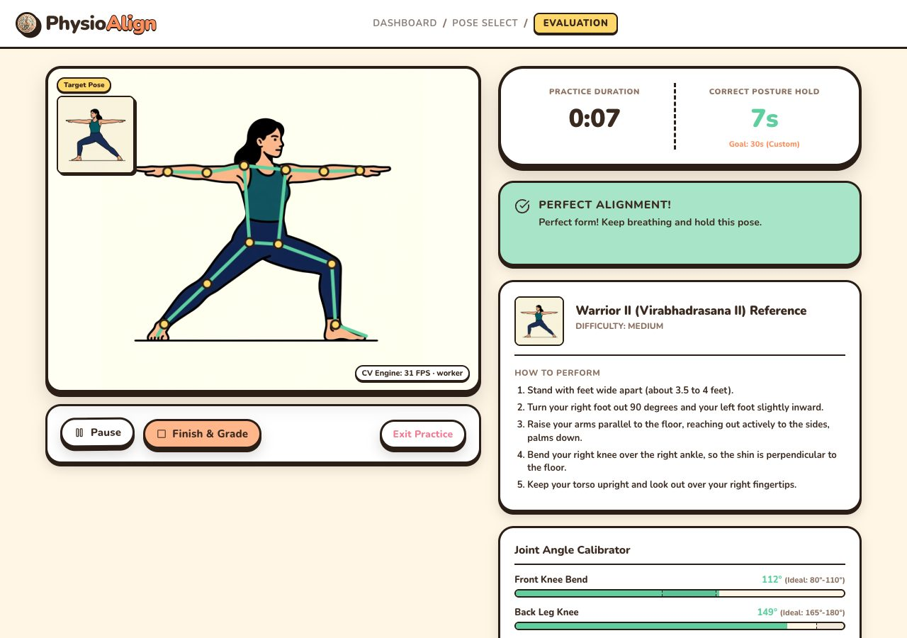
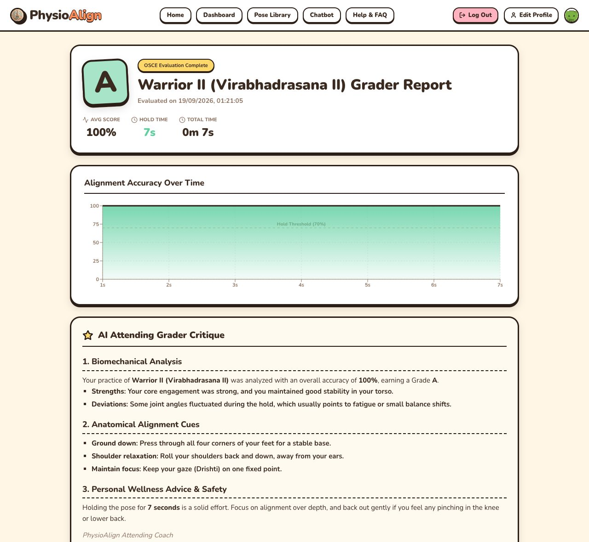
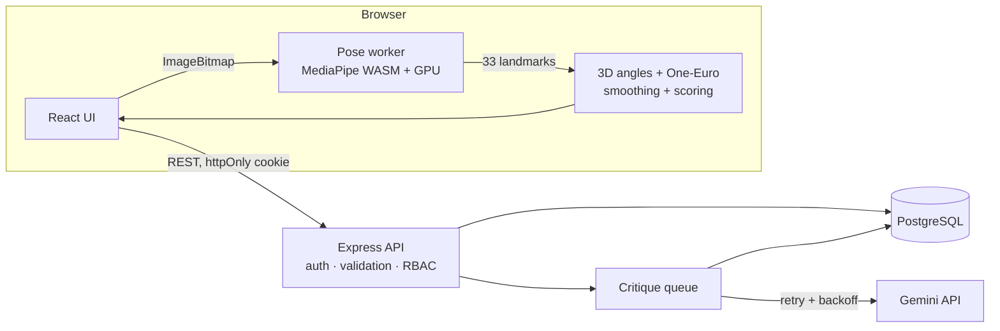

# PhysioAlign

[](https://github.com/Arush-O7/PhysioAlign/actions/workflows/ci.yml)

A webcam posture coach for yoga and physiotherapy exercises. It tracks 33 body landmarks in the browser and scores 3D joint angles against target ranges for each pose. It gives on-screen and spoken corrections as you move, times how long you hold good form, and sends each session to a clinician dashboard with an AI-written report.

<p align="center">
  
  
</p>

**Roles:**
- **Patients** practise poses, track progress and chat with AI coaches.
- **Doctors** (after admin approval) review their assigned patients' sessions and prescribe care plans.
- **Admins** manage accounts, approve doctors and assign patients.

## Engineering highlights

| | What | Result |
| --- | --- | --- |
| **Off-main-thread inference** | MediaPipe runs in a Web Worker. Frames are passed as transferable `ImageBitmap`s, one frame in flight at a time. | Main thread time per frame: **17.8 ms → 0.3 ms** (median), same 17.5 ms processing latency |
| **Jitter-free feedback** | One-Euro filter on each joint angle, plus a 250 ms debounce on the displayed correction | Correction flicker **755 → 10 flips/min (-99%)**. Real errors are still flagged within **300 ms**. |
| **3D joint angles** | Angles are calculated from world landmarks in metres, not 2D image coordinates | Readings no longer depend on camera angle or the 4:3 aspect ratio |
| **Async report generation** | Sessions save straight away (`202 Accepted`). A queue with retries writes the Gemini critique in the background, and the client polls with backoff. Pending jobs resume after a restart. | Saving no longer waits several seconds for the LLM |
| **Code splitting** | Screens behind the login are lazy-loaded, then prefetched in the background once the user signs in | Initial JS **728.8 KB → 200.3 KB** (gzip 200.4 → 60.1 KB) |
| **Security** | httpOnly `SameSite=Lax` session cookie, CSRF header check, role-based access with per-doctor patient scoping, Zod validation on every body, server-side Google ID-token verification, rate-limited auth, PBKDF2 (210k iterations) with rehash on login | Covered by the API test suite |
| **Schema migrations** | Versioned, transactional migrations with an advisory lock. Existing databases are upgraded in place: `TEXT` JSON becomes `JSONB`, the `clerk_id` column is renamed to `user_id`, and indexes are added. | Tested against the pre-migration production schema |

The pose numbers were measured on an Apple M4 in Chrome 153 (GPU delegate) over 300 frames of a 640×480 feed. To measure on your own machine, open the app with `?perf` and run `__perf()` in the console. To reproduce the smoothing numbers, run `npm run bench:smoothing`.

## Architecture



The video never leaves the browser. Only the per-second scores and angles are sent to the server.

## Tech stack

- **Frontend:** React 18, TypeScript, Vite, MediaPipe Tasks Vision, Recharts
- **Backend:** Node.js, Express, TypeScript, Zod, PostgreSQL (`pg`), Google Gemini
- **Tooling:** Vitest, Supertest, GitHub Actions, Docker, Render

## Running locally

**With Docker** (includes Postgres):

```bash
docker compose up --build
# http://localhost:5001
```

**Without Docker** (needs Node 18+ and a Postgres database):

```bash
npm install
cp .env.example .env      # set DATABASE_URL and AUTH_SECRET at least
npm run dev:full          # web on :5173, API on :5001
```

Migrations run automatically when the server starts.

## Tests

```bash
TEST_DATABASE_URL=postgres://localhost:5432/physio_test npm test
```

There are 57 tests:
- **Unit tests:** angle maths, pose scoring, smoothing, HTML sanitising, tokens, passwords, rate limiting.
- **API tests:** run against a real Postgres. They cover auth and cookies, CSRF, role and patient-level access control, validation, the async critique pipeline, and upgrading the legacy schema.

The API tests wipe the database they point at, so use a throwaway one. Without `TEST_DATABASE_URL` they're skipped. CI runs type checks, all tests, the production build and a Docker build on every push.

## Deploying on Render

`render.yaml` defines the service:
- Build: `npm ci --include=dev && npm run build`
- Start: `npm start`
- Health check: `/api/health`

Set `DATABASE_URL`, `AUTH_SECRET`, `GEMINI_API_KEY`, `VITE_GOOGLE_CLIENT_ID` and optionally `ADMIN_EMAILS`. With Supabase, use the **Session pooler** connection string, because the direct host is IPv6-only and Render can't reach it.

## API

| Method | Path | Access |
| --- | --- | --- |
| `POST` | `/api/auth/signup`, `/login`, `/google`, `/logout` | public, rate limited |
| `GET`, `PUT` | `/api/users/me` | signed in |
| `GET` | `/api/users/:id`, `/api/users/:id/sessions` | self, assigned doctor, admin |
| `POST` | `/api/sessions` → `202` | signed in |
| `GET`, `DELETE` | `/api/sessions/:id` | owner (+ assigned doctor to read) |
| `POST` | `/api/sessions/:id/critique/retry` | owner |
| `POST` | `/api/coach/chat` | signed in |
| `GET` | `/api/doctor/patients` | approved doctor (own patients), admin |
| `GET`, `PUT`, `POST` | `/api/doctor/patients/:id/sessions`, `/care-plan`, `/insight` | assigned doctor, admin |
| `GET`, `PUT`, `POST`, `DELETE` | `/api/admin/...` | admin |
| `GET` | `/api/health` | public |

## Project layout

```
backend/src/
  routes/        HTTP layer: validation and access checks
  services/      business logic, SQL, Gemini, critique queue, tokens
  middleware/    auth, CSRF, rate limiting, errors
  db/            connection pool and versioned migrations
backend/test/    API and unit tests
src/
  components/    screens
  data/poses.ts  pose definitions and scoring rules
  utils/         angle maths, smoothing, pose detector, api client
public/pose-worker.js   MediaPipe inference worker
scripts/         benchmark and db check
```

## Notes

- The in-memory rate limiter and critique queue assume a single server instance. Scaling out would need Redis or a proper job queue.
- This is a personal project, not a medical device.
